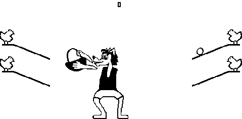

# Игра "Ну, погоди!"
Четыре курицы, сидящие на насестах, несут яйца, скатывающиеся вниз по четырём лоткам. Управляя Волком (из мультфильма «Ну, погоди!»), который может принимать четыре положения (напротив каждого лотка), требуется наловить как можно больше яиц в корзину. При падении яйца игрок проигрывает.  
  
# Управление:  
- 1 - опустить корзину влево вниз
- 2 - опустить корзину вправо вниз
- 4 - поднять корзину влево вверх
- 5 - поднять корзину вправо вверх

# Картинки
  
